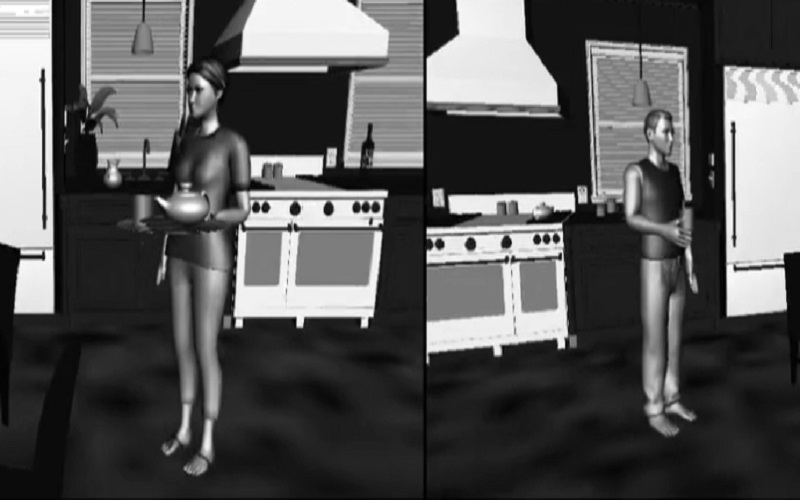

<!DOCTYPE html>
<html>
<head>
<meta name="viewport" content="width=device-width, initial-scale=1">

</head>
<body>

    

        
English Language

		
    

 

        
La Langue Fançaise

				
    

	
    

        
Հայոց լեզու

				
    
	
  

  
    

 
    

  
    

  
    

 
    

  
    

  
    

 
    

  
    

  
    

 
    

 

   
   
   
   
   
    
   
   
    
   
   

  

  
    

 

  
  

 

  
    

  
    

 

  
  

 

  
    

  
    

 

  
  

  
    

  
    

 

  
  

</body>
</html> 
